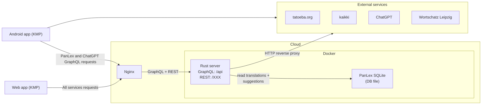

# What

Lexisoup is an Android and a web app, which gives you a "soup" of lexical data about foreign words:
- Words' translations
- Explanations
- Forms
- Synonyms
- Usages examples

Lexisoup has no data of its own.
Instead, in the hope of bringing a better understanding of the word, lexisoup brings together data from the following sources:
- PanLex
- Kaikki (Wiktionary)
- Tatoeba
- Wortschatz Leipzig
- ChatGPT

Some of the sources are queried directly by the Android app, some sources are queried from the lexisoup server, which can be found here: https://github.com/blazern/lexisoup-server
The web-app queries all the services through the lexisoup server (because of CORS).

# Overall project architecture

